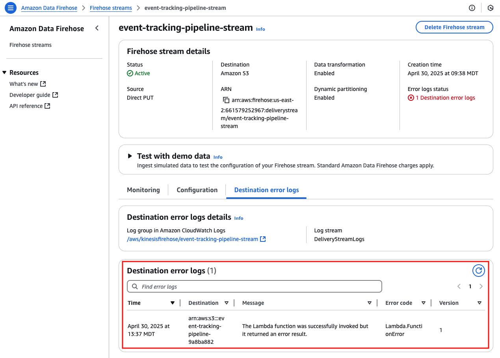

# Event Tracking Pipeline 🚀


## Overview 📋
This project implements a serverless event tracking pipeline using AWS services to collect, process, store, and analyze user events. It leverages Amazon Kinesis Firehose for data ingestion, AWS Lambda for data transformation, Amazon S3 for storage, AWS Glue for data cataloging, and Amazon Athena for querying. The `event_analysis.ipynb` Jupyter notebook uses the `awswrangler` package to run SQL queries on Athena, enabling actionable analytics on user behavior. The infrastructure is defined using Terraform, following a modular structure for maintainability and scalability.

## Highlights 🌟
This project includes key enhancements for performance, maintainability, and cost efficiency:

- **Partition Projection for Cost Savings**: Implemented partition projection in AWS Glue to dynamically manage partitions based on `event_date`. This significantly reduces the amount of data scanned during Athena queries, lowering query costs and improving performance.
    * Test query: `SELECT * from events_db.events WHERE event_date >= 2024-06-01`
    * Data scanned reduced by 90% compared to `SELECT * from events_db.events`
        * (from 12.84MB to 1.12 MB) due to partitioning

- **Maintainable Data Management**: The partition projection solution eliminates the need for manual partition creation as new events arrive, ensuring a scalable and low-maintenance pipeline for future data growth.
    * No need to run `MSCK REPAIR TABLE` to add new paritions as new events arrive
    * No need to terraform a Glue Crawler to update partitions

- **Enhanced Logging with Cost Control**: Configured CloudWatch log groups for Firehose and Lambda with a 90-day retention policy. This supports reliable monitoring and debugging while controlling storage costs by automatically expiring old logs.
    * Log events added to data processing Lambda for troubleshooting support.
    * Linked destination error logs in S3 back to Firehose for faster incident analysis: 
- **Tight IAM Permissions for Security:** Refined IAM policies to follow a right-of-least-privilege pattern, granting only necessary permissions to Firehose, Lambda, and Glue services. This security enhancement prevents cross-contamination if several of these pipelines were deployed and running.

## Approach 🛠️
The development of this project followed an iterative approach, starting with a Minimum Viable Product (MVP) and progressing to a more robust `v1` version:

### MVP (mvp branch)
The initial version, available on the `mvp` branch, focused on establishing the core functionality of the event tracking pipeline. It included basic Terraform resources to set up:
  - Kinesis Firehose for event ingestion.
  - AWS Lambda for event transformation.
  - S3 buckets for data storage and query results.
  - AWS Glue for data cataloging.
  - Amazon Athena for querying.
  - Basic IAM roles and policies.

The MVP provided a functional pipeline but lacked optimizations like partitioning and comprehensive logging.

### v1 (main branch)
The `v1` version, available on the `main` branch, introduced significant enhancements for performance, cost efficiency, and maintainability:
  - **Projected Partitioning**: Added partition projection in the Glue table configuration (`glue.tf`) to dynamically manage partitions based on `event_date`. This reduced the data scanned during Athena queries, lowering costs and improving query performance.
  - **Explicit Log Groups with Retention Policies**: Configured CloudWatch log groups for Firehose and Lambda with a 90-day retention policy (`firehose.tf`, `lambda.tf`). This ensured auditability while controlling storage costs.
  - **Modular Terraform Structure**: Organized Terraform configurations into separate files (`athena.tf`, `firehose.tf`, `glue.tf`, `iam.tf`, `lambda.tf`, `s3.tf`) for better maintainability.
  - **Tightened IAM Policies**: Refined IAM policies (`iam.tf`) to follow the principle of least privilege, reducing security risks.
  The `v1` version builds on the MVP by adding production-ready features while maintaining the core functionality.

## Project Structure 📂
```
├── notebooks/        
│   ├── event_analysis.ipynb  # Jupyter notebook for querying Athena with awswrangler
├── scripts/     
│   ├── event_generator.py    # Script to generate and send sample events
├── terraform/
│   ├── athena.tf             # Athena resource and workgroup configuration
│   ├── firehose.tf           # Kinesis Firehose delivery stream
│   ├── glue.tf               # Glue database and table with partition projection
│   ├── iam.tf                # IAM roles and policies
│   ├── lambda.tf             # Lambda function for event transformation
│   ├── locals.tf
│   ├── main.tf
│   ├── outputs.tf             
│   ├── s3.tf                 # S3 buckets for event data and query results
│   ├── variables.tf
└── lambda/
    ├── transform_payload.py  # Lambda function code for data enrichment
```

## Prerequisites ✅
- **AWS Account**: Configured with appropriate permissions.
- **Terraform**: Version 1.5+ installed.
- **Python**: Version 3.11+ for event generation, Lambda, and `event_analysis.ipynb`.
- **AWS CLI**: Configured with credentials.
- **Dependencies**: Install Python packages for `event_generator.py` and `event_analysis.ipynb`:
  ```bash
  pip install boto3 faker awswrangler pandas
  ```

## Setup Instructions 🛠️
1. **Clone the Repository**:
   ```bash
   git clone <repository-url>
   cd <repository-directory>
   ```

2. **Deploy Infrastructure with Terraform**:
   - Initialize Terraform:
     ```bash
     cd terraform
     terraform init
     ```
   - Apply the configuration (ensure AWS credentials are set):
     ```bash
     terraform apply
     ```
     This creates S3 buckets, Firehose stream, Lambda function, Glue catalog, Athena workgroup, and IAM roles.

3. **Package Lambda Function**:
   - Zip the Lambda code:
     ```bash
     cd lambda
     zip -r transform_payload.zip transform_payload.py
     ```
   - Ensure the zip file is referenced in `lambda.tf`.

4. **Generate Sample Events**:
   - Run the event generator script:
     ```bash
     python event_generator.py
     ```
     This sends 100,000 sample events to the Firehose stream.

5. **Run Athena Queries with `event_analysis.ipynb`**:
   - Install Jupyter and dependencies:
     ```bash
     pip install jupyter
     ```
   - Open `event_analysis.ipynb` in a Jupyter environment:
     ```bash
     jupyter notebook
     ```
   - Update `DATABASE` (`events_db`) and `S3_BUCKET` (Athena query results bucket) variables if needed.
   - Execute the notebook cells to run Athena queries using the `awswrangler` package.

## Usage 🎯
- **Generating Events**: Use `event_generator.py` to simulate user events. Modify `num_events`, `browsers`, `devices`, `event_types`, `pages`, or `user_ids` for custom scenarios.
- **Querying Data with `event_analysis.ipynb`**: The notebook uses `awswrangler` to query Athena, providing insights into user behavior. Example queries include:
  - Top active users by event count.
  - User event flows in a 60-day window.
  - Pages driving purchases.
  - Users losing interest (churn risk).
  - Platform engagement by device.
  - Failed login attempts.

## Security 🔒
- **IAM Policies**: Follow least-privilege principles, granting only necessary permissions to Firehose, Lambda, and Glue.
- **S3 Buckets**: Configured with unique names and `force_destroy` for testing. Update for production to secure data.
- **Logging**: 90-day retention for CloudWatch logs ensures auditability without excessive storage costs.

## Example Queries in `event_analysis.ipynb` 📊
The `event_analysis.ipynb` notebook uses `awswrangler` to execute SQL queries on Athena, including:
- **Events by User**: Identifies the top 10 most active users by event count.
- **User Event Flow**: Analyzes the top user's activities (e.g., page visits, event types) in the past 60 days.
- **Purchase Drivers**: Tracks pages visited before purchases to understand conversion paths.
- **Churning Users**: Detects users with declining activity for retention outreach.
- **Platform Engagement**: Compares average events per month across devices (Desktop, Mobile, Tablet).
- **Login Issues**: Identifies users with frequent failed login attempts for support intervention.

## Troubleshooting 🐞
- **Firehose Errors**: Check CloudWatch log group for delivery failures or S3 destination errors.
- **Lambda Errors**: Check CloudWatch log group for data transform errors.
- **IAM Issues**: Confirm roles have required permissions as defined in `iam.tf`.

## Future Improvements 🚀
- Implement monitoring alarms for Firehose delivery errors or Lambda failures.
- Implement long-term S3 retention strategy to move events to cold storage for cost optimization.
- Consider further modularization of terraform resources into separate folders if more infrastructure is added.
- Consider modelling data into logical units (i.e. users, activities) to further support analytics queries.

## Contact 📧
For questions or contributions, contact [Your Name] at [Your Email].